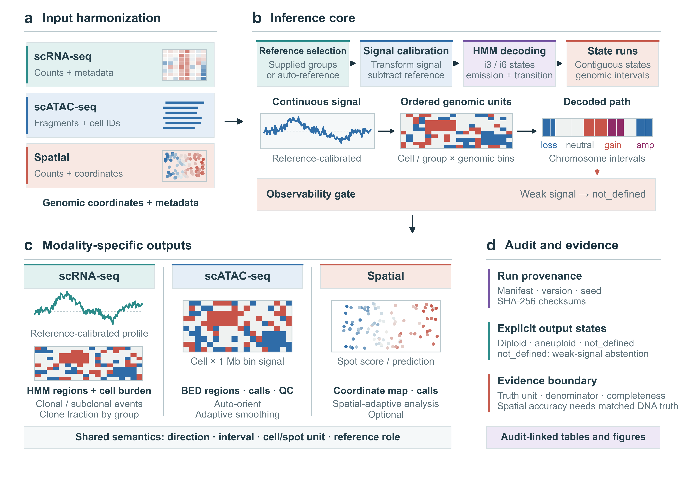
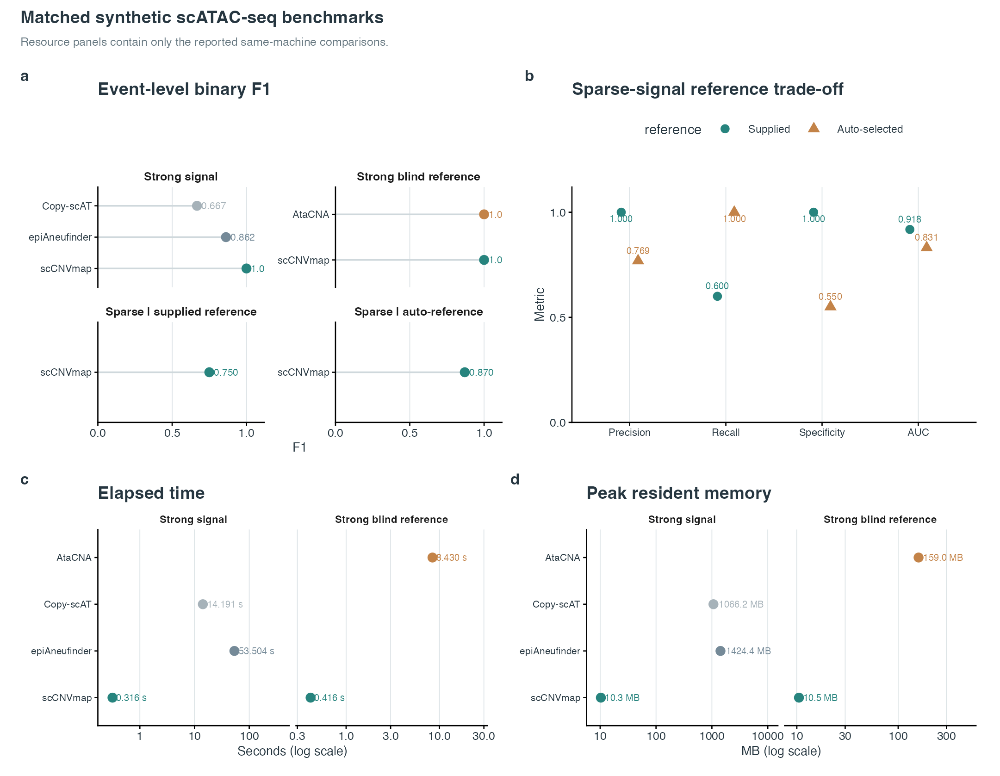
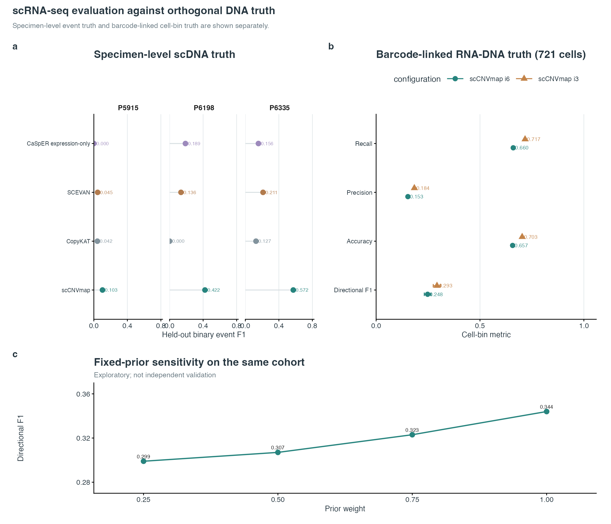
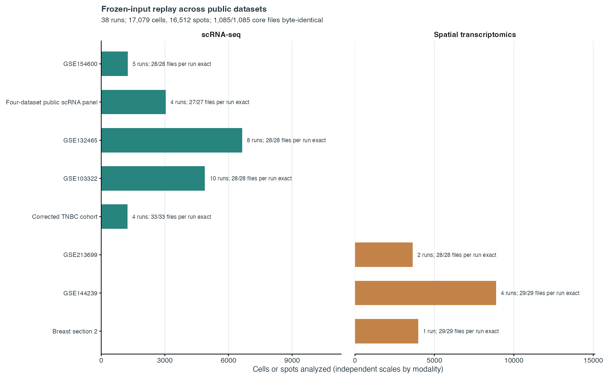
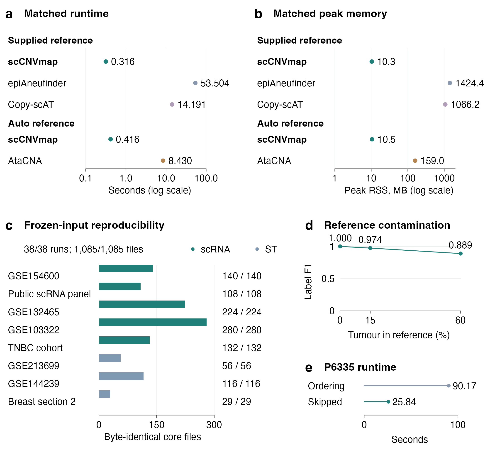

# scCNVmap

**Cross-modal CNV inference for scRNA-seq, scATAC-seq and spatial transcriptomics.**

scCNVmap converts modality-specific measurements into reference-calibrated genomic signals, decodes contiguous copy-number states, and exports intervals, calls, QC metrics and run provenance. A shared output vocabulary makes results comparable across modalities while retaining modality-specific evidence. Weak or absent signal is reported as `not_defined` rather than forced into a gain/loss call.

This public repository contains the prebuilt release package, small test fixtures, tutorials and selected article figures. It does **not** contain the application source code. The figures below are included for orientation and reproducibility; they are not a substitute for the source tables, run manifests or independent truth definitions distributed with the manuscript evidence package.

## What the method does

| Modality | Input contract | Main outputs |
| --- | --- | --- |
| scRNA-seq | Gene-by-cell counts, gene order and cell annotations | HMM segments, cell-level CNV burden, event summaries and QC |
| scATAC-seq | Compressed five-column fragments and cell annotations | Genomic-bin signal, per-cell calls, BED regions and fragment QC |
| Spatial transcriptomics | Counts, gene order, spot annotations and coordinates | Spot scores, spatial predictions, group events and coordinate-aware QC |

The inference path is: input harmonization -> reference selection -> signal calibration -> HMM decoding -> contiguous genomic intervals -> observability gate -> audit-linked outputs. Reference groups can be supplied explicitly or selected automatically, depending on modality and run settings.

## Method overview



**Figure 1.** scCNVmap harmonizes three input modalities, calibrates their signals against supplied or automatically selected references, decodes i3/i6 hidden states, and exports modality-specific calls with provenance and an explicit weak-signal state. The figure is the article's method overview; it is a schematic of the analysis contract rather than a quantitative benchmark.

## Results at a glance

### Matched synthetic scATAC-seq benchmark



**Figure 2.** Matched synthetic scATAC-seq comparisons report event-level F1, sparse-signal reference sensitivity, elapsed time and peak resident memory. The synthetic fixtures are deterministic workflow tests and should not be interpreted as biological validation or as a replacement for real-data truth.

### scRNA-seq against orthogonal DNA truth



**Figure 3.** scRNA-seq evaluation separates specimen-level scDNA event truth from barcode-linked RNA-DNA truth. The held-out event panel, paired-cell metrics and fixed-prior sensitivity are reported separately so that cell-level and specimen-level denominators are not conflated. The fixed-prior panel is exploratory sensitivity analysis, not independent validation.

### Frozen-input replay across public datasets



**Figure 4.** Frozen-input replay summarizes the public multi-dataset runs currently represented in the manuscript evidence: 38 runs, 17,079 cells, 16,512 spots and 1,085/1,085 core files byte-identical in the recorded replay checks. Counts are audit summaries, not claims that every dataset is an independent biological replicate.

### Resource and reproducibility checks



**Figure 5.** Matched runtime and peak memory, frozen-input reproducibility, reference contamination sensitivity and a P6335 ordering comparison. Resource panels use the same-machine comparisons recorded in the manuscript evidence.

## Download and run

The current public release is **v0.5.0** for Linux x86_64:

- [Release page](https://github.com/diogobaird/scCNVmap/releases/tag/v0.5.0)
- [Download `scCNVmap-v0.5.0-linux-x86_64.tar.gz`](https://github.com/diogobaird/scCNVmap/releases/download/v0.5.0/scCNVmap-v0.5.0-linux-x86_64.tar.gz)
- [Download SHA-256 file](https://github.com/diogobaird/scCNVmap/releases/download/v0.5.0/scCNVmap-v0.5.0-linux-x86_64.tar.gz.sha256)

```sh
curl -LO https://github.com/diogobaird/scCNVmap/releases/download/v0.5.0/scCNVmap-v0.5.0-linux-x86_64.tar.gz
curl -LO https://github.com/diogobaird/scCNVmap/releases/download/v0.5.0/scCNVmap-v0.5.0-linux-x86_64.tar.gz.sha256
sha256sum -c scCNVmap-v0.5.0-linux-x86_64.tar.gz.sha256
tar -xzf scCNVmap-v0.5.0-linux-x86_64.tar.gz
./scCNVmap --version
./scCNVmap --help
```

The published archive contains the executable, runtime documentation and the BSD 3-Clause license. Release assets are separate from the files on the `main` branch.

## Test data

`test_data/` contains small invented fixtures for smoke testing and input-format checks:

- `scrna/`: counts, `gene_order.tsv` and cell annotations.
- `scatac/`: compressed fragments and cell annotations.
- `spatial/`: counts, gene order, spot annotations and `spatial_coords.tsv`.
- `synthetic_expression/`: a compact expression fixture with an explicit test-only README.

All tables are tab-separated. Matrix identifiers must match annotation identifiers; genomic order files use `gene`, `chr`, `start` and `end`. These fixtures are not patient data, are not an accuracy benchmark and must not be used to support biological conclusions.

## Tutorials

The notebooks show the complete input contract, CLI invocation, output tables and article-grade figure rendering for each modality:

- [scRNA-seq tutorial](tutorials/scCNVmap_scRNA_tutorial.ipynb)
- [scATAC-seq tutorial](tutorials/scCNVmap_scATAC_tutorial.ipynb)
- [Spatial transcriptomics tutorial](tutorials/scCNVmap_ST_tutorial.ipynb)
- [Tutorial overview and reproducibility notes](tutorials/README.md)

Install the notebook dependencies with:

```sh
python -m pip install -r tutorials/requirements.txt
```

The notebooks use clearly labelled `demo_results/` fixtures only when `USE_DEMO=True` and the executable is unavailable. Those fixtures demonstrate output format and rendering; they are not presented as new inference results. Public datasets mentioned in the notebooks are not redistributed here. Obtain them from their original repositories and follow their access and citation requirements.

## Evidence and interpretation

The manuscript's result figures should be read with their source tables, run manifests, parameter settings and independent truth definition. Cells and spots are observational units, not biological replicates. A heatmap or spatial score map is descriptive; accuracy requires a matched orthogonal truth set and an explicit denominator. Weak-signal calls remain `not_defined` when evidence is insufficient.

## License

The README, tutorials, figures and bundled test fixtures are distributed under the [MIT License](LICENSE). The scCNVmap binary release retains its BSD 3-Clause license; see the `LICENSE` file included in the release archive.
